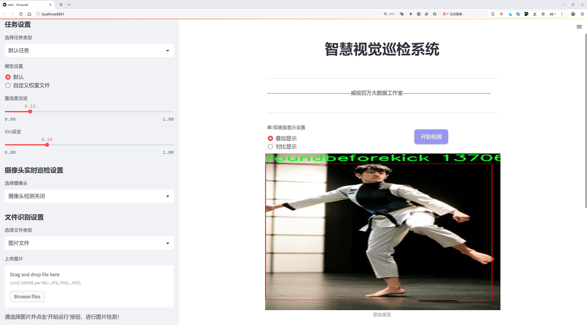

# 跆拳道动作识别检测系统源码分享
 # [一条龙教学YOLOV8标注好的数据集一键训练_70+全套改进创新点发刊_Web前端展示]

### 1.研究背景与意义

项目参考[AAAI Association for the Advancement of Artificial Intelligence](https://gitee.com/qunmasj/projects)

项目来源[AACV Association for the Advancement of Computer Vision](https://kdocs.cn/l/cszuIiCKVNis)

研究背景与意义

随着人工智能技术的迅猛发展，计算机视觉领域的研究取得了显著进展，尤其是在物体检测和动作识别方面。跆拳道作为一种具有丰富文化内涵和广泛群众基础的武术运动，其动作的复杂性和多样性为计算机视觉技术的应用提供了良好的研究平台。传统的跆拳道动作识别方法往往依赖于人工特征提取和简单的分类算法，效率低下且准确率有限。近年来，深度学习技术的兴起，尤其是YOLO（You Only Look Once）系列模型的不断改进，为实时动作识别提供了新的解决方案。YOLOv8作为该系列的最新版本，凭借其高效的检测速度和优越的精度，成为动作识别领域的研究热点。

本研究旨在基于改进的YOLOv8模型，构建一个高效的跆拳道动作识别系统。我们使用的数据集包含2000张图像，涵盖了9个不同的动作类别，包括“准备姿势”、“前踢”、“上踢”、“回旋踢”等。这些类别不仅反映了跆拳道动作的多样性，也为模型的训练和测试提供了丰富的样本。通过对这些动作的精确识别，系统能够为跆拳道的教学、训练和比赛提供有效的技术支持，推动跆拳道运动的普及与发展。

在技术层面，YOLOv8模型的改进将集中在提升其对复杂背景和多样化动作的适应能力上。传统YOLO模型在处理快速运动和重叠动作时，往往面临检测精度下降的问题。因此，本研究将结合数据增强、迁移学习等技术，优化模型的训练过程，力求在保证实时性的同时，提升识别的准确率。此外，针对跆拳道动作的特征，我们将设计特定的损失函数，以增强模型对动作细节的敏感性，确保其在实际应用中的可靠性。

本研究的意义不仅在于技术上的创新，更在于其对跆拳道运动的推广和普及具有深远的影响。通过建立高效的动作识别系统，教练和学员可以实时获取动作反馈，及时纠正错误，提高训练效果。同时，该系统也可以应用于比赛分析，帮助裁判和观众更好地理解比赛过程，提升观赛体验。此外，基于此系统的研究成果，未来还可以扩展到其他武术和体育项目的动作识别中，推动整个体育领域的智能化发展。

综上所述，基于改进YOLOv8的跆拳道动作识别系统的研究，不仅具有重要的学术价值，也为实际应用提供了切实可行的解决方案。通过深入探讨该领域的前沿技术，我们期望能够为跆拳道的训练与教学提供新的思路，推动智能体育的发展，为更多的运动爱好者带来便利与乐趣。

### 2.图片演示




##### 注意：由于此博客编辑较早，上面“2.图片演示”和“3.视频演示”展示的系统图片或者视频可能为老版本，新版本在老版本的基础上升级如下：（实际效果以升级的新版本为准）

  （1）适配了YOLOV8的“目标检测”模型和“实例分割”模型，通过加载相应的权重（.pt）文件即可自适应加载模型。

  （2）支持“图片识别”、“视频识别”、“摄像头实时识别”三种识别模式。

  （3）支持“图片识别”、“视频识别”、“摄像头实时识别”三种识别结果保存导出，解决手动导出（容易卡顿出现爆内存）存在的问题，识别完自动保存结果并导出到tempDir中。

  （4）支持Web前端系统中的标题、背景图等自定义修改，后面提供修改教程。

  另外本项目提供训练的数据集和训练教程,暂不提供权重文件（best.pt）,需要您按照教程进行训练后实现图片演示和Web前端界面演示的效果。

### 3.视频演示

[3.1 视频演示](https://www.bilibili.com/video/BV1hEs9eoEYh/)

### 4.数据集信息展示

##### 4.1 本项目数据集详细数据（类别数＆类别名）

nc: 9
names: ['beforereadypose', 'frontkick', 'frontkickbeforekick', 'readypose', 'risingkick', 'roundbeforekick', 'roundkick', 'roundkickendpose', 'standing']


##### 4.2 本项目数据集信息介绍

数据集信息展示

在构建和优化跆拳道动作识别系统的过程中，数据集的选择和构建至关重要。本项目采用的数据集名为“projectUniteam”，其设计旨在为改进YOLOv8模型提供丰富的训练样本，以实现高效且准确的动作识别。该数据集包含九个不同的类别，涵盖了跆拳道中常见的动作，这些类别的选择不仅反映了跆拳道的基本动作，也为模型的训练提供了多样性和复杂性。

首先，数据集中包含的第一个类别是“beforereadypose”，这一动作是跆拳道练习中的基础准备姿势，通常是运动员在开始任何技术动作之前所采取的姿势。通过对这一类别的训练，模型能够学习到运动员在进行其他动作之前的身体状态，为后续动作的识别打下基础。

接下来是“frontkick”，这一类别代表了跆拳道中最常见的前踢动作。前踢是许多攻击和防守策略的核心，能够有效地测试模型对快速、动态动作的识别能力。与之相关的“frontkickbeforekick”类别则提供了一个重要的上下文，展示了运动员在执行前踢之前的准备动作，这对于理解动作的连续性和流畅性至关重要。

“readypose”是另一个关键类别，代表了运动员在准备开始一系列动作时的静态姿势。通过对这一类别的训练，模型能够识别出运动员的准备状态，从而提高对后续动作的预测准确性。紧接着的“risingkick”类别则展示了运动员在进行上踢时的动态变化，这一动作通常用于进攻和防守，具有较高的技术要求。

此外，“roundbeforekick”类别则是运动员在进行回旋踢之前的准备状态，提供了对动作前期的深刻理解。而“roundkick”类别则是跆拳道中极具观赏性和技术性的动作之一，模型在这一类别的训练中将学习到如何识别复杂的身体运动和姿态变化。紧接着的“roundkickendpose”则展示了运动员在完成回旋踢后的姿势，进一步丰富了模型对动作完成状态的理解。

最后，“standing”类别作为一个基础的静态姿势，提供了对运动员在未进行任何动作时的状态的识别能力。这一类别的存在不仅为模型提供了对比参考，也帮助其在动态和静态之间进行有效的区分。

通过对“projectUniteam”数据集的深入分析，可以看出，该数据集的设计充分考虑了跆拳道动作的多样性和复杂性，为YOLOv8模型的训练提供了丰富的样本。这些类别的选择不仅有助于提高模型对各种动作的识别能力，也为后续的动作分析和应用奠定了坚实的基础。随着数据集的不断扩展和优化，预计该系统将在跆拳道动作识别领域取得显著的进展，为运动员的训练和比赛提供更为精准的技术支持。


### 5.全套项目环境部署视频教程（零基础手把手教学）

[5.1 环境部署教程链接（零基础手把手教学）](https://www.ixigua.com/7404473917358506534?logTag=c807d0cbc21c0ef59de5)


[5.2 安装Python虚拟环境创建和依赖库安装视频教程链接（零基础手把手教学）](https://www.ixigua.com/7404474678003106304?logTag=1f1041108cd1f708b01a)

### 6.手把手YOLOV8训练视频教程（零基础小白有手就能学会）

[6.1 手把手YOLOV8训练视频教程（零基础小白有手就能学会）](https://www.ixigua.com/7404477157818401292?logTag=d31a2dfd1983c9668658)

### 7.70+种全套YOLOV8创新点代码加载调参视频教程（一键加载写好的改进模型的配置文件）

[7.1 70+种全套YOLOV8创新点代码加载调参视频教程（一键加载写好的改进模型的配置文件）](https://www.ixigua.com/7404478314661806627?logTag=29066f8288e3f4eea3a4)

### 8.70+种全套YOLOV8创新点原理讲解（非科班也可以轻松写刊发刊，V10版本正在科研待更新）

由于篇幅限制，每个创新点的具体原理讲解就不一一展开，具体见下列网址中的创新点对应子项目的技术原理博客网址【Blog】：


[8.1 70+种全套YOLOV8创新点原理讲解链接](https://gitee.com/qunmasj/good)

### 9.系统功能展示（检测对象为举例，实际内容以本项目数据集为准）

图9.1.系统支持检测结果表格显示

  图9.2.系统支持置信度和IOU阈值手动调节

  图9.3.系统支持自定义加载权重文件best.pt(需要你通过步骤5中训练获得)

  图9.4.系统支持摄像头实时识别

  图9.5.系统支持图片识别

  图9.6.系统支持视频识别

  图9.7.系统支持识别结果文件自动保存

  图9.8.系统支持Excel导出检测结果数据


### 10.原始YOLOV8算法原理

原始YOLOv8算法原理

YOLOv8是Ultralytics于2023年1月发布的一款前沿目标检测模型，标志着YOLO系列的又一次重大进化。该模型在设计上吸收了前几代YOLO模型（如YOLOX、YOLOv6、YOLOv7和PPYOLOE）的优点，尤其是在Head标签分配和Loss计算方面，体现了PP-YOLOE的设计理念。这种集成式的创新使得YOLOv8在实时目标检测领域达到了新的高度，展现出高精度和快速响应的特性，为目标检测技术的应用带来了新的可能性。

YOLOv8的架构由三个主要部分组成：Backbone、Neck和Head。Backbone负责特征提取，采用了CSPDarknet（Cross Stage Partial Darknet）结构。这一结构通过将网络分为两个部分，并在每个部分中引入多个残差块，极大地增强了特征提取的能力。相较于前代模型YOLOv5，YOLOv8引入了C2f模块来替代C3模块，C2f模块通过将输入特征图分为两个分支，并对每个分支进行卷积降维，从而有效地提升了特征图的维度和信息流动。每个v8_C2fBottleneck层的输出也被视为一个分支，这种设计使得特征图的堆叠更加丰富，从而获得了更高维度的特征信息。

在特征提取过程中，YOLOv8还引入了快速空间金字塔池化（SPPF）结构，以提取不同尺度的特征。这一设计不仅有效减少了模型的参数量和计算量，还提高了特征提取的效率，使得YOLOv8在处理复杂场景时能够更好地捕捉到目标信息。特征提取后的信息通过Neck部分进行进一步处理，Neck部分采用了特征金字塔网络（FPN）和路径聚合网络（PAN）的组合结构，这种结构通过多个卷积层和池化层对特征图进行压缩和处理，从而为后续的目标检测提供了更为精炼的特征表示。

YOLOv8的目标检测部分采用了一种基于无锚框（Anchor-Free）的检测方式，这一创新使得模型能够直接预测目标的中心点及其宽高比例。与传统的锚框方法相比，这种方式不仅减少了Anchor框的数量，还显著提高了检测速度和准确度。这种无锚框的设计理念，使得YOLOv8在面对多样化的目标形态和尺寸时，能够更灵活地进行检测，进一步提升了模型的实用性。

此外，YOLOv8还提供了轻量化版本，即YOLOv8n，旨在为资源受限的设备提供高效的目标检测解决方案。YOLOv8n在Backbone部分使用了更轻量化的C2F模块，减少了计算复杂度，同时在特征融合层中引入了BiFPN网络，通过高效的双向跨尺度连接和加权特征融合，进一步提升了模型对不同尺度特征信息的提取速度。这种轻量化设计，使得YOLOv8n在移动设备和嵌入式系统中也能实现实时目标检测，拓宽了YOLOv8的应用场景。

YOLOv8的设计不仅关注于模型的性能提升，还强调了其在实际应用中的灵活性和适应性。例如，在农业领域，YOLOv8可以被应用于苹果采摘的自动化过程中，通过其强大的视觉识别能力，自动检测和定位苹果，帮助采摘机器人快速而准确地完成任务。这种结合了目标检测与路径规划（如蚁群算法）的应用，展示了YOLOv8在实际场景中的广泛适用性和潜力。

总的来说，YOLOv8通过对前代模型的深入分析与创新，成功地实现了高效的特征提取与目标检测。其无锚框的检测方式、灵活的网络结构以及轻量化设计，使得YOLOv8在目标检测领域树立了新的标杆。随着技术的不断进步，YOLOv8无疑将为更多行业带来革命性的变化，推动智能化应用的深入发展。


### 11.项目核心源码讲解（再也不用担心看不懂代码逻辑）

#### 11.1 val.py

以下是对代码中最核心部分的提取和详细中文注释：

```python
class DetectionValidator(BaseValidator):
    """
    DetectionValidator类用于基于检测模型的验证，继承自BaseValidator类。
    """

    def __init__(self, dataloader=None, save_dir=None, pbar=None, args=None, _callbacks=None):
        """初始化检测模型所需的变量和设置。"""
        super().__init__(dataloader, save_dir, pbar, args, _callbacks)
        self.nt_per_class = None  # 每个类别的目标数量
        self.is_coco = False  # 是否为COCO数据集
        self.class_map = None  # 类别映射
        self.args.task = "detect"  # 任务类型设置为检测
        self.metrics = DetMetrics(save_dir=self.save_dir, on_plot=self.on_plot)  # 初始化检测指标
        self.iouv = torch.linspace(0.5, 0.95, 10)  # IoU向量，用于计算mAP@0.5:0.95
        self.niou = self.iouv.numel()  # IoU数量
        self.lb = []  # 用于自动标注

    def preprocess(self, batch):
        """对YOLO训练的图像批次进行预处理。"""
        batch["img"] = batch["img"].to(self.device, non_blocking=True)  # 将图像转移到设备上
        batch["img"] = (batch["img"].half() if self.args.half else batch["img"].float()) / 255  # 归一化图像
        for k in ["batch_idx", "cls", "bboxes"]:
            batch[k] = batch[k].to(self.device)  # 将其他数据转移到设备上

        # 如果需要保存混合标签
        if self.args.save_hybrid:
            height, width = batch["img"].shape[2:]  # 获取图像的高度和宽度
            nb = len(batch["img"])  # 批次中图像的数量
            bboxes = batch["bboxes"] * torch.tensor((width, height, width, height), device=self.device)  # 计算边界框
            self.lb = [
                torch.cat([batch["cls"][batch["batch_idx"] == i], bboxes[batch["batch_idx"] == i]], dim=-1)
                for i in range(nb)
            ]  # 为自动标注生成标签

        return batch  # 返回处理后的批次

    def postprocess(self, preds):
        """对预测输出应用非极大值抑制（NMS）。"""
        return ops.non_max_suppression(
            preds,
            self.args.conf,  # 置信度阈值
            self.args.iou,  # IoU阈值
            labels=self.lb,  # 标签
            multi_label=True,  # 多标签
            agnostic=self.args.single_cls,  # 是否单类
            max_det=self.args.max_det,  # 最大检测数量
        )

    def update_metrics(self, preds, batch):
        """更新指标统计信息。"""
        for si, pred in enumerate(preds):  # 遍历每个预测
            self.seen += 1  # 记录已处理的样本数量
            npr = len(pred)  # 当前预测的数量
            stat = dict(
                conf=torch.zeros(0, device=self.device),  # 置信度
                pred_cls=torch.zeros(0, device=self.device),  # 预测类别
                tp=torch.zeros(npr, self.niou, dtype=torch.bool, device=self.device),  # 真阳性
            )
            pbatch = self._prepare_batch(si, batch)  # 准备当前批次
            cls, bbox = pbatch.pop("cls"), pbatch.pop("bbox")  # 获取真实类别和边界框
            nl = len(cls)  # 真实目标数量
            stat["target_cls"] = cls  # 记录真实类别

            if npr == 0:  # 如果没有预测
                if nl:
                    for k in self.stats.keys():
                        self.stats[k].append(stat[k])  # 更新统计信息
                continue  # 继续下一个预测

            # 处理预测
            predn = self._prepare_pred(pred, pbatch)  # 准备预测数据
            stat["conf"] = predn[:, 4]  # 置信度
            stat["pred_cls"] = predn[:, 5]  # 预测类别

            # 评估
            if nl:
                stat["tp"] = self._process_batch(predn, bbox, cls)  # 处理当前批次的预测
            for k in self.stats.keys():
                self.stats[k].append(stat[k])  # 更新统计信息

            # 保存预测结果
            if self.args.save_json:
                self.pred_to_json(predn, batch["im_file"][si])  # 保存为JSON格式
            if self.args.save_txt:
                file = self.save_dir / "labels" / f'{Path(batch["im_file"][si]).stem}.txt'
                self.save_one_txt(predn, self.args.save_conf, pbatch["ori_shape"], file)  # 保存为TXT格式

    def get_stats(self):
        """返回指标统计信息和结果字典。"""
        stats = {k: torch.cat(v, 0).cpu().numpy() for k, v in self.stats.items()}  # 转换为numpy数组
        if len(stats) and stats["tp"].any():  # 如果有真阳性
            self.metrics.process(**stats)  # 处理指标
        self.nt_per_class = np.bincount(
            stats["target_cls"].astype(int), minlength=self.nc
        )  # 计算每个类别的目标数量
        return self.metrics.results_dict  # 返回结果字典
```

### 主要功能概述：
1. **初始化**：设置模型参数和指标。
2. **预处理**：对输入的图像批次进行预处理，包括归一化和设备转移。
3. **后处理**：对模型预测结果应用非极大值抑制，去除冗余框。
4. **更新指标**：在每个批次中更新检测指标，记录真阳性、置信度和预测类别。
5. **统计结果**：计算并返回各类的检测统计信息。

以上是代码的核心部分及其详细注释，帮助理解YOLO模型的验证过程。

这个程序文件 `val.py` 是一个用于YOLO（You Only Look Once）目标检测模型验证的实现，继承自 `BaseValidator` 类。它的主要功能是对模型在验证集上的表现进行评估，包括计算各种指标、处理预测结果、绘制可视化图像等。

首先，程序导入了一些必要的库，包括 `os`、`numpy` 和 `torch`，以及一些来自 `ultralytics` 的模块，这些模块提供了数据处理、模型验证、日志记录和绘图等功能。

在 `DetectionValidator` 类的构造函数中，初始化了一些变量和设置，包括目标检测任务的类型、评估指标、IoU（Intersection over Union）向量等。该类的主要功能是对模型的输出进行处理和评估。

`preprocess` 方法用于对输入的图像批次进行预处理，包括将图像转换为适合模型输入的格式，并根据需要进行归一化处理。还会根据参数决定是否保存混合标签。

`init_metrics` 方法初始化评估指标，包括判断数据集是否为COCO格式，设置类别映射，并准备混淆矩阵和其他统计信息。

`get_desc` 方法返回一个格式化的字符串，用于总结每个类别的指标。

`postprocess` 方法对模型的预测结果应用非极大值抑制（NMS），以去除冗余的检测框。

`_prepare_batch` 和 `_prepare_pred` 方法分别用于准备真实标签和预测结果，以便后续的评估。

`update_metrics` 方法用于更新评估指标，处理每个批次的预测结果和真实标签，并将结果保存到指定格式的文件中。

`finalize_metrics` 方法用于设置最终的指标值，包括速度和混淆矩阵。

`get_stats` 方法返回指标统计信息和结果字典。

`print_results` 方法打印训练或验证集的每个类别的指标，并根据需要绘制混淆矩阵。

`_process_batch` 方法用于返回正确的预测矩阵，计算IoU并匹配预测与真实标签。

`build_dataset` 和 `get_dataloader` 方法用于构建YOLO数据集和返回数据加载器。

`plot_val_samples` 和 `plot_predictions` 方法用于绘制验证图像样本和预测结果，并保存图像。

`save_one_txt` 方法将YOLO检测结果保存为特定格式的文本文件。

`pred_to_json` 方法将YOLO预测结果序列化为COCO格式的JSON文件。

`eval_json` 方法用于评估YOLO输出的JSON格式，并返回性能统计信息，使用pycocotools库计算mAP（mean Average Precision）。

整体而言，这个文件实现了YOLO模型验证的完整流程，包括数据预处理、模型评估、结果输出和可视化等功能，适用于目标检测任务的模型验证阶段。

#### 11.2 code\ultralytics\models\fastsam\utils.py

以下是经过简化和详细注释的核心代码部分：

```python
import torch

def adjust_bboxes_to_image_border(boxes, image_shape, threshold=20):
    """
    调整边界框，使其在距离图像边界一定阈值内时贴合边界。

    参数:
        boxes (torch.Tensor): 边界框坐标，形状为 (n, 4)
        image_shape (tuple): 图像的高度和宽度，形状为 (height, width)
        threshold (int): 像素阈值

    返回:
        adjusted_boxes (torch.Tensor): 调整后的边界框
    """
    h, w = image_shape  # 获取图像的高度和宽度

    # 调整边界框的坐标
    boxes[boxes[:, 0] < threshold, 0] = 0  # 如果左上角 x 坐标小于阈值，则设置为 0
    boxes[boxes[:, 1] < threshold, 1] = 0  # 如果左上角 y 坐标小于阈值，则设置为 0
    boxes[boxes[:, 2] > w - threshold, 2] = w  # 如果右下角 x 坐标大于图像宽度减去阈值，则设置为图像宽度
    boxes[boxes[:, 3] > h - threshold, 3] = h  # 如果右下角 y 坐标大于图像高度减去阈值，则设置为图像高度
    return boxes  # 返回调整后的边界框

def bbox_iou(box1, boxes, iou_thres=0.9, image_shape=(640, 640), raw_output=False):
    """
    计算一个边界框与其他边界框的交并比（IoU）。

    参数:
        box1 (torch.Tensor): 单个边界框，形状为 (4, )
        boxes (torch.Tensor): 其他边界框，形状为 (n, 4)
        iou_thres (float): IoU 阈值
        image_shape (tuple): 图像的高度和宽度，形状为 (height, width)
        raw_output (bool): 如果为 True，则返回原始 IoU 值而不是索引

    返回:
        high_iou_indices (torch.Tensor): IoU 大于阈值的边界框索引
    """
    boxes = adjust_bboxes_to_image_border(boxes, image_shape)  # 调整边界框以贴合图像边界

    # 计算交集的坐标
    x1 = torch.max(box1[0], boxes[:, 0])  # 交集左上角 x 坐标
    y1 = torch.max(box1[1], boxes[:, 1])  # 交集左上角 y 坐标
    x2 = torch.min(box1[2], boxes[:, 2])  # 交集右下角 x 坐标
    y2 = torch.min(box1[3], boxes[:, 3])  # 交集右下角 y 坐标

    # 计算交集的面积
    intersection = (x2 - x1).clamp(0) * (y2 - y1).clamp(0)  # 使用 clamp 确保面积不为负

    # 计算两个边界框的面积
    box1_area = (box1[2] - box1[0]) * (box1[3] - box1[1])  # box1 的面积
    box2_area = (boxes[:, 2] - boxes[:, 0]) * (boxes[:, 3] - boxes[:, 1])  # boxes 的面积

    # 计算并集的面积
    union = box1_area + box2_area - intersection  # 并集面积

    # 计算 IoU
    iou = intersection / union  # 交并比
    if raw_output:
        return 0 if iou.numel() == 0 else iou  # 如果需要原始 IoU 值，则返回

    # 返回 IoU 大于阈值的边界框索引
    return torch.nonzero(iou > iou_thres).flatten()
```

### 代码说明：
1. **`adjust_bboxes_to_image_border` 函数**：用于调整边界框的位置，使其在接近图像边界时贴合边界。通过设置阈值，确保边界框不会超出图像的边界。
2. **`bbox_iou` 函数**：计算一个边界框与其他边界框之间的交并比（IoU），用于评估它们的重叠程度。该函数首先调用 `adjust_bboxes_to_image_border` 来调整边界框，然后计算交集和并集的面积，最后返回 IoU 大于给定阈值的边界框索引。

这个程序文件主要包含两个函数，分别用于调整边界框的位置以及计算边界框之间的交并比（IoU）。

第一个函数 `adjust_bboxes_to_image_border` 的作用是将边界框调整到图像的边界上，如果它们距离边界的距离小于指定的阈值。函数接收三个参数：`boxes` 是一个形状为 (n, 4) 的张量，表示 n 个边界框，每个边界框由四个坐标（x1, y1, x2, y2）定义；`image_shape` 是一个元组，包含图像的高度和宽度；`threshold` 是一个整数，表示距离边界的阈值。函数首先获取图像的高度和宽度，然后根据阈值调整边界框的位置，确保它们不会超出图像的边界。

第二个函数 `bbox_iou` 用于计算一个边界框与一组其他边界框之间的交并比。它接收多个参数，包括 `box1`（待计算的边界框）、`boxes`（其他边界框）、`iou_thres`（IoU阈值）、`image_shape`（图像的高度和宽度）以及 `raw_output`（一个布尔值，指示是否返回原始的IoU值）。在函数内部，首先调用 `adjust_bboxes_to_image_border` 函数调整边界框的位置。接着，计算两个边界框的交集坐标，并利用这些坐标计算交集的面积。然后，计算每个边界框的面积，最后计算交并比（IoU）。如果 `raw_output` 为真，函数将返回原始的IoU值；否则，它将返回与阈值比较后，IoU值大于指定阈值的边界框的索引。

总体而言，这个文件的功能是处理图像中的边界框，确保它们在图像边界内，并计算它们之间的重叠程度，为后续的目标检测和图像处理任务提供支持。

#### 11.3 code\ultralytics\utils\loss.py

以下是代码中最核心的部分，包含了损失函数的实现，主要用于目标检测和关键点检测任务。代码中包含了不同类型的损失函数，包括Varifocal Loss、Focal Loss、Bbox Loss等。每个类的功能和实现都进行了详细的中文注释。

```python
import torch
import torch.nn as nn
import torch.nn.functional as F

class VarifocalLoss(nn.Module):
    """
    Varifocal Loss 是一种用于目标检测的损失函数，旨在提高对难以分类样本的关注。
    参考文献: https://arxiv.org/abs/2008.13367
    """

    def __init__(self):
        """初始化 VarifocalLoss 类。"""
        super().__init__()

    @staticmethod
    def forward(pred_score, gt_score, label, alpha=0.75, gamma=2.0):
        """计算 Varifocal Loss。"""
        # 计算权重
        weight = alpha * pred_score.sigmoid().pow(gamma) * (1 - label) + gt_score * label
        with torch.cuda.amp.autocast(enabled=False):
            # 计算损失
            loss = (
                (F.binary_cross_entropy_with_logits(pred_score.float(), gt_score.float(), reduction="none") * weight)
                .mean(1)
                .sum()
            )
        return loss


class BboxLoss(nn.Module):
    """用于计算边界框损失的类。"""

    def __init__(self, reg_max, use_dfl=False):
        """初始化 BboxLoss 模块，设置最大正则化和 DFL 设置。"""
        super().__init__()
        self.reg_max = reg_max  # 最大正则化
        self.use_dfl = use_dfl  # 是否使用分布焦点损失

    def forward(self, pred_dist, pred_bboxes, anchor_points, target_bboxes, target_scores, target_scores_sum, fg_mask):
        """计算 IoU 损失。"""
        weight = target_scores.sum(-1)[fg_mask].unsqueeze(-1)  # 计算权重
        iou = bbox_iou(pred_bboxes[fg_mask], target_bboxes[fg_mask], xywh=False, CIoU=True)  # 计算 IoU
        loss_iou = ((1.0 - iou) * weight).sum() / target_scores_sum  # IoU 损失

        # DFL 损失
        if self.use_dfl:
            target_ltrb = bbox2dist(anchor_points, target_bboxes, self.reg_max)  # 将目标框转换为距离
            loss_dfl = self._df_loss(pred_dist[fg_mask].view(-1, self.reg_max + 1), target_ltrb[fg_mask]) * weight
            loss_dfl = loss_dfl.sum() / target_scores_sum
        else:
            loss_dfl = torch.tensor(0.0).to(pred_dist.device)

        return loss_iou, loss_dfl  # 返回 IoU 损失和 DFL 损失

    @staticmethod
    def _df_loss(pred_dist, target):
        """返回左侧和右侧 DFL 损失的总和。"""
        tl = target.long()  # 目标左侧
        tr = tl + 1  # 目标右侧
        wl = tr - target  # 左侧权重
        wr = 1 - wl  # 右侧权重
        return (
            F.cross_entropy(pred_dist, tl.view(-1), reduction="none").view(tl.shape) * wl
            + F.cross_entropy(pred_dist, tr.view(-1), reduction="none").view(tl.shape) * wr
        ).mean(-1, keepdim=True)


class v8DetectionLoss:
    """用于计算训练损失的类。"""

    def __init__(self, model):  # 模型必须是去并行化的
        """初始化 v8DetectionLoss，定义模型相关属性和 BCE 损失函数。"""
        device = next(model.parameters()).device  # 获取模型设备
        h = model.args  # 超参数

        m = model.model[-1]  # Detect() 模块
        self.bce = nn.BCEWithLogitsLoss(reduction="none")  # 二元交叉熵损失
        self.hyp = h  # 超参数
        self.stride = m.stride  # 模型步幅
        self.nc = m.nc  # 类别数量
        self.no = m.no
        self.reg_max = m.reg_max
        self.device = device

        self.use_dfl = m.reg_max > 1  # 判断是否使用 DFL

        self.bbox_loss = BboxLoss(m.reg_max - 1, use_dfl=self.use_dfl).to(device)  # 初始化边界框损失

    def __call__(self, preds, batch):
        """计算边界框、分类和 DFL 的损失总和。"""
        loss = torch.zeros(3, device=self.device)  # box, cls, dfl
        feats = preds[1] if isinstance(preds, tuple) else preds
        pred_distri, pred_scores = torch.cat([xi.view(feats[0].shape[0], self.no, -1) for xi in feats], 2).split(
            (self.reg_max * 4, self.nc), 1
        )

        pred_scores = pred_scores.permute(0, 2, 1).contiguous()
        pred_distri = pred_distri.permute(0, 2, 1).contiguous()

        dtype = pred_scores.dtype
        batch_size = pred_scores.shape[0]
        imgsz = torch.tensor(feats[0].shape[2:], device=self.device, dtype=dtype) * self.stride[0]  # 图像大小 (h,w)

        # 目标处理
        targets = torch.cat((batch["batch_idx"].view(-1, 1), batch["cls"].view(-1, 1), batch["bboxes"]), 1)
        gt_labels, gt_bboxes = targets.split((1, 4), 2)  # cls, xyxy
        mask_gt = gt_bboxes.sum(2, keepdim=True).gt_(0)

        # 计算边界框
        pred_bboxes = self.bbox_decode(anchor_points, pred_distri)  # xyxy, (b, h*w, 4)

        # 计算损失
        loss[1] = self.bce(pred_scores, target_scores.to(dtype)).sum() / target_scores_sum  # 分类损失

        if fg_mask.sum():
            target_bboxes /= stride_tensor
            loss[0], loss[2] = self.bbox_loss(
                pred_distri, pred_bboxes, anchor_points, target_bboxes, target_scores, target_scores_sum, fg_mask
            )

        loss[0] *= self.hyp.box  # box gain
        loss[1] *= self.hyp.cls  # cls gain
        loss[2] *= self.hyp.dfl  # dfl gain

        return loss.sum() * batch_size, loss.detach()  # 返回总损失和损失的副本
```

以上代码片段保留了最核心的部分，涵盖了多种损失函数的实现，并提供了详细的中文注释，以帮助理解每个部分的功能和实现细节。

这个程序文件主要定义了与目标检测和分割相关的损失函数，使用PyTorch框架实现。文件中包含多个类，每个类负责计算不同类型的损失，主要包括Varifocal Loss、Focal Loss、Bbox Loss、Keypoint Loss等。这些损失函数在训练深度学习模型时用于优化模型的性能。

首先，`VarifocalLoss`类实现了一种变焦损失，主要用于处理目标检测中的分类问题。它通过计算预测分数和真实分数之间的二元交叉熵损失，并结合权重因子来调整损失的影响。权重因子由预测分数和真实标签决定。

接下来，`FocalLoss`类实现了焦点损失，旨在解决类别不平衡问题。它通过调整损失的计算方式，使得模型在训练时更加关注难以分类的样本。该损失函数的计算涉及到预测概率和真实标签的关系，并通过调节参数来控制损失的强度。

`BboxLoss`类用于计算边界框的损失，主要通过IoU（Intersection over Union）来评估预测框与真实框之间的重叠程度。该类还支持DFL（Distribution Focal Loss），用于处理边界框的分布预测。损失的计算涉及到权重的应用，以便更好地反映目标的相对重要性。

`RotatedBboxLoss`类是`BboxLoss`的扩展，专门用于处理旋转边界框的损失计算。它使用与`BboxLoss`类似的方法，但考虑了旋转角度的影响。

`KeypointLoss`类用于计算关键点的损失，主要用于姿态估计任务。它通过计算预测关键点与真实关键点之间的欧几里得距离来评估模型的性能，并根据关键点的可见性进行加权。

`v8DetectionLoss`类是一个综合性的损失计算类，整合了上述损失函数以便在目标检测任务中使用。它包含了数据预处理、边界框解码和损失计算的逻辑。该类通过调用不同的损失函数来计算最终的损失值，并根据超参数进行加权。

`v8SegmentationLoss`和`v8PoseLoss`类分别用于实例分割和姿态估计任务，扩展了`v8DetectionLoss`类，增加了特定于这些任务的损失计算逻辑。

最后，`v8ClassificationLoss`和`v8OBBLoss`类分别用于分类任务和旋转边界框的损失计算，提供了针对不同任务的损失函数实现。

整体而言，这个文件为目标检测、分割和姿态估计等任务提供了丰富的损失函数实现，旨在提高模型的训练效果和准确性。

#### 11.4 train.py

以下是经过简化和注释的核心代码部分，主要关注于YOLO检测模型的训练过程：

```python
import random
import numpy as np
import torch.nn as nn
from ultralytics.data import build_dataloader, build_yolo_dataset
from ultralytics.engine.trainer import BaseTrainer
from ultralytics.models import yolo
from ultralytics.nn.tasks import DetectionModel
from ultralytics.utils import LOGGER, RANK
from ultralytics.utils.torch_utils import de_parallel, torch_distributed_zero_first

class DetectionTrainer(BaseTrainer):
    """
    扩展自BaseTrainer类，用于基于检测模型的训练。
    """

    def build_dataset(self, img_path, mode="train", batch=None):
        """
        构建YOLO数据集。

        参数:
            img_path (str): 包含图像的文件夹路径。
            mode (str): 模式，可以是'train'或'val'，用于自定义不同的增强。
            batch (int, optional): 批次大小，仅用于'rect'模式。默认为None。
        """
        gs = max(int(de_parallel(self.model).stride.max() if self.model else 0), 32)
        return build_yolo_dataset(self.args, img_path, batch, self.data, mode=mode, rect=mode == "val", stride=gs)

    def get_dataloader(self, dataset_path, batch_size=16, rank=0, mode="train"):
        """构造并返回数据加载器。"""
        assert mode in ["train", "val"]
        with torch_distributed_zero_first(rank):  # 仅在DDP中初始化数据集*.cache一次
            dataset = self.build_dataset(dataset_path, mode, batch_size)
        shuffle = mode == "train"  # 训练模式下打乱数据
        workers = self.args.workers if mode == "train" else self.args.workers * 2
        return build_dataloader(dataset, batch_size, workers, shuffle, rank)  # 返回数据加载器

    def preprocess_batch(self, batch):
        """对图像批次进行预处理，包括缩放和转换为浮点数。"""
        batch["img"] = batch["img"].to(self.device, non_blocking=True).float() / 255  # 将图像转换为浮点数并归一化
        if self.args.multi_scale:  # 如果启用多尺度
            imgs = batch["img"]
            sz = (
                random.randrange(self.args.imgsz * 0.5, self.args.imgsz * 1.5 + self.stride)
                // self.stride
                * self.stride
            )  # 随机选择图像大小
            sf = sz / max(imgs.shape[2:])  # 计算缩放因子
            if sf != 1:
                ns = [
                    math.ceil(x * sf / self.stride) * self.stride for x in imgs.shape[2:]
                ]  # 计算新的形状
                imgs = nn.functional.interpolate(imgs, size=ns, mode="bilinear", align_corners=False)  # 进行插值
            batch["img"] = imgs
        return batch

    def get_model(self, cfg=None, weights=None, verbose=True):
        """返回YOLO检测模型。"""
        model = DetectionModel(cfg, nc=self.data["nc"], verbose=verbose and RANK == -1)  # 创建检测模型
        if weights:
            model.load(weights)  # 加载权重
        return model

    def plot_training_samples(self, batch, ni):
        """绘制带有注释的训练样本。"""
        plot_images(
            images=batch["img"],
            batch_idx=batch["batch_idx"],
            cls=batch["cls"].squeeze(-1),
            bboxes=batch["bboxes"],
            paths=batch["im_file"],
            fname=self.save_dir / f"train_batch{ni}.jpg",
            on_plot=self.on_plot,
        )

    def plot_metrics(self):
        """从CSV文件中绘制指标。"""
        plot_results(file=self.csv, on_plot=self.on_plot)  # 保存结果图
```

### 代码注释说明：
1. **类 `DetectionTrainer`**: 这是一个用于训练YOLO检测模型的类，继承自`BaseTrainer`。
2. **`build_dataset` 方法**: 负责构建YOLO数据集，支持训练和验证模式。
3. **`get_dataloader` 方法**: 创建数据加载器，支持多进程和分布式训练。
4. **`preprocess_batch` 方法**: 对输入的图像批次进行预处理，包括归一化和多尺度调整。
5. **`get_model` 方法**: 创建并返回YOLO检测模型，支持加载预训练权重。
6. **`plot_training_samples` 方法**: 绘制训练样本及其对应的标签。
7. **`plot_metrics` 方法**: 从CSV文件中读取训练指标并绘制图表。

这些核心部分构成了YOLO模型训练的基础，确保了数据的准备、模型的构建和训练过程中的可视化。

这个程序文件 `train.py` 是一个用于训练 YOLO（You Only Look Once）目标检测模型的实现，继承自 `BaseTrainer` 类。程序的主要功能是构建数据集、创建数据加载器、预处理图像、设置模型属性、获取模型、验证模型、记录损失、绘制训练样本和指标等。

在文件的开头，导入了一些必要的库和模块，包括数学运算、随机数生成、深度学习相关的库（如 PyTorch）以及 YOLO 模型和数据处理的相关工具。

`DetectionTrainer` 类中定义了多个方法。`build_dataset` 方法用于构建 YOLO 数据集，接受图像路径、模式（训练或验证）和批次大小作为参数。它会根据模型的步幅计算最大步幅，并调用 `build_yolo_dataset` 函数来构建数据集。

`get_dataloader` 方法用于构建并返回数据加载器。它首先确保模式是有效的（训练或验证），然后调用 `build_dataset` 方法来初始化数据集。根据模式决定是否打乱数据，并设置工作线程的数量。最后，它调用 `build_dataloader` 函数返回数据加载器。

`preprocess_batch` 方法负责对图像批次进行预处理，包括将图像缩放并转换为浮点数。该方法支持多尺度训练，随机选择图像大小，并使用双线性插值调整图像尺寸。

`set_model_attributes` 方法用于设置模型的属性，包括类别数量和类别名称。它将数据集中的类别信息附加到模型上，以便模型能够正确处理不同的类别。

`get_model` 方法返回一个 YOLO 检测模型，并可以加载预训练权重。它根据配置和类别数量初始化模型。

`get_validator` 方法返回一个用于验证 YOLO 模型的验证器，设置损失名称并传递必要的参数。

`label_loss_items` 方法用于返回带有标签的训练损失项字典，适用于分割和检测任务。

`progress_string` 方法返回一个格式化的字符串，显示训练进度，包括当前的轮次、GPU 内存使用情况、损失值、实例数量和图像大小。

`plot_training_samples` 方法用于绘制训练样本及其注释，调用 `plot_images` 函数将图像、类别和边界框等信息可视化。

最后，`plot_metrics` 和 `plot_training_labels` 方法分别用于绘制训练指标和创建带标签的训练图。前者从 CSV 文件中读取数据并生成结果图，后者则将训练集中所有标签的边界框和类别信息可视化。

整体而言，这个文件实现了 YOLO 模型训练的各个环节，提供了数据处理、模型训练和结果可视化的完整流程。

#### 11.5 70+种YOLOv8算法改进源码大全和调试加载训练教程（非必要）\ultralytics\data\__init__.py

```python
# Ultralytics YOLO 🚀, AGPL-3.0 license

# 从当前模块导入基础数据集类
from .base import BaseDataset
# 从构建模块导入构建数据加载器、构建YOLO数据集和加载推理源的函数
from .build import build_dataloader, build_yolo_dataset, load_inference_source
# 从数据集模块导入分类数据集、语义数据集和YOLO数据集类
from .dataset import ClassificationDataset, SemanticDataset, YOLODataset

# 定义当前模块的公共接口，包含可供外部使用的类和函数
__all__ = (
    'BaseDataset',          # 基础数据集类
    'ClassificationDataset', # 分类数据集类
    'SemanticDataset',      # 语义数据集类
    'YOLODataset',          # YOLO数据集类
    'build_yolo_dataset',   # 构建YOLO数据集的函数
    'build_dataloader',     # 构建数据加载器的函数
    'load_inference_source'  # 加载推理源的函数
)
```

### 代码核心部分说明：
1. **导入模块**：
   - `BaseDataset` 是所有数据集的基础类，提供了数据集的基本功能。
   - `build_dataloader` 用于创建数据加载器，负责批量加载数据。
   - `build_yolo_dataset` 用于构建YOLO特定的数据集，适配YOLO模型的输入。
   - `load_inference_source` 用于加载推理所需的数据源。

2. **数据集类**：
   - `ClassificationDataset` 用于处理分类任务的数据集。
   - `SemanticDataset` 用于处理语义分割任务的数据集。
   - `YOLODataset` 专门为YOLO模型设计的数据集，处理目标检测任务。

3. **公共接口**：
   - `__all__` 列表定义了模块的公共接口，确保只有这些类和函数可以被外部导入，隐藏了内部实现细节。

这个程序文件是Ultralytics YOLO（You Only Look Once）项目的一部分，主要用于数据处理和加载。文件中首先声明了该项目遵循AGPL-3.0许可证。接下来，文件通过相对导入的方式引入了几个模块和类，这些模块和类在YOLO的实现中起着重要的作用。

具体来说，`BaseDataset`是一个基础数据集类，可能包含一些通用的方法和属性，供其他数据集类继承和使用。`build_dataloader`、`build_yolo_dataset`和`load_inference_source`是用于构建数据加载器和数据集的函数，帮助在训练和推理过程中有效地处理数据。

此外，文件中还引入了三个具体的数据集类：`ClassificationDataset`、`SemanticDataset`和`YOLODataset`。这些类分别用于处理不同类型的数据集，适应不同的任务需求，如分类、语义分割和目标检测。

最后，`__all__`变量定义了模块的公共接口，列出了可以被外部导入的类和函数。这种做法有助于提高代码的可读性和可维护性，确保用户只接触到必要的部分。整体来看，这个文件在YOLOv8算法的实现中扮演着数据管理和加载的重要角色。

#### 11.6 ui.py

```python
import sys
import subprocess

def run_script(script_path):
    """
    使用当前 Python 环境运行指定的脚本。

    Args:
        script_path (str): 要运行的脚本路径

    Returns:
        None
    """
    # 获取当前 Python 解释器的路径
    python_path = sys.executable

    # 构建运行命令，使用 streamlit 运行指定的脚本
    command = f'"{python_path}" -m streamlit run "{script_path}"'

    # 执行命令
    result = subprocess.run(command, shell=True)
    # 检查命令执行结果，如果返回码不为0，则表示出错
    if result.returncode != 0:
        print("脚本运行出错。")


# 主程序入口
if __name__ == "__main__":
    # 指定要运行的脚本路径
    script_path = "web.py"  # 这里可以直接指定脚本路径

    # 调用函数运行脚本
    run_script(script_path)
```

### 代码核心部分及注释说明：

1. **导入模块**：
   - `sys`：用于访问与 Python 解释器紧密相关的变量和函数。
   - `subprocess`：用于创建新进程、连接到它们的输入/输出/错误管道，并获得返回码。

2. **`run_script` 函数**：
   - 功能：在当前 Python 环境中运行指定的脚本。
   - 参数：`script_path`，要运行的脚本的路径。
   - 过程：
     - 获取当前 Python 解释器的路径，以便可以使用它来运行脚本。
     - 构建命令字符串，使用 `streamlit` 模块运行指定的脚本。
     - 使用 `subprocess.run` 执行命令，并检查返回码以判断脚本是否成功运行。

3. **主程序入口**：
   - 使用 `if __name__ == "__main__":` 确保代码只在直接运行时执行，而不是被导入时执行。
   - 指定要运行的脚本路径，并调用 `run_script` 函数来执行该脚本。

这个程序文件的主要功能是通过当前的 Python 环境来运行一个指定的脚本，具体来说是运行一个名为 `web.py` 的脚本。程序首先导入了必要的模块，包括 `sys`、`os` 和 `subprocess`，以及一个自定义的路径处理模块 `abs_path`。

在 `run_script` 函数中，首先获取当前 Python 解释器的路径，这样可以确保使用正确的 Python 环境来执行脚本。接着，构建一个命令字符串，该命令使用 `streamlit` 模块来运行指定的脚本。这里使用了 `-m` 参数来指定模块，确保脚本能够以模块的形式被执行。

随后，使用 `subprocess.run` 方法来执行构建好的命令。这个方法会在一个新的进程中运行命令，并等待其完成。如果脚本运行过程中出现错误，返回的状态码将不为零，程序会打印出“脚本运行出错”的提示信息。

在文件的最后部分，使用 `if __name__ == "__main__":` 语句来确保只有在直接运行该文件时才会执行下面的代码。这部分代码指定了要运行的脚本路径，这里是通过 `abs_path` 函数获取的 `web.py` 的绝对路径。最后，调用 `run_script` 函数来实际运行这个脚本。

总体来说，这个程序的设计目的是为了方便地在指定的 Python 环境中运行一个 Streamlit 应用脚本，提供了一种简单的方式来启动 Web 应用。

### 12.系统整体结构（节选）

### 整体功能和构架概括

该项目是一个基于YOLO（You Only Look Once）目标检测框架的实现，主要用于目标检测、分割和姿态估计等任务。项目的结构包括数据处理、模型训练、损失计算、验证、可视化和用户界面等多个模块。每个模块负责特定的功能，使得整个系统能够高效地进行模型训练和评估。

- **数据处理**：包括数据集的构建和加载，支持不同类型的数据集（如分类、分割和检测）。
- **模型训练**：实现了训练流程，包括数据预处理、模型构建、损失计算和训练过程的监控。
- **损失计算**：定义了多种损失函数，以适应不同的任务需求，优化模型性能。
- **验证**：提供了模型验证的实现，评估模型在验证集上的表现。
- **可视化**：绘制训练样本、指标和结果，帮助用户理解模型的训练过程。
- **用户界面**：通过Streamlit等工具提供了简单的用户界面，方便用户与模型进行交互。

### 文件功能整理表

| 文件路径                                                                                              | 功能描述                                                                                     |
|------------------------------------------------------------------------------------------------------|----------------------------------------------------------------------------------------------|
| `D:\tools\20240809\code\val.py`                                                                     | 实现YOLO模型的验证，包括指标计算、结果处理和可视化。                                        |
| `D:\tools\20240809\code\code\ultralytics\models\fastsam\utils.py`                                 | 包含用于调整边界框和计算IoU的实用函数。                                                     |
| `D:\tools\20240809\code\code\ultralytics\utils\loss.py`                                           | 定义多种损失函数（如Varifocal Loss、Focal Loss等），用于目标检测和分割任务的训练。         |
| `D:\tools\20240809\code\train.py`                                                                   | 实现YOLO模型的训练流程，包括数据集构建、模型初始化、损失计算和训练监控。                   |
| `D:\tools\20240809\code\70+种YOLOv8算法改进源码大全和调试加载训练教程（非必要）\ultralytics\data\__init__.py` | 管理数据集和数据加载器的模块，提供基础数据集类和构建函数。                                  |
| `D:\tools\20240809\code\ui.py`                                                                      | 通过Streamlit运行指定的Web应用脚本，提供用户界面。                                         |
| `D:\tools\20240809\code\70+种YOLOv8算法改进源码大全和调试加载训练教程（非必要）\ultralytics\trackers\__init__.py` | 可能包含与目标跟踪相关的功能和类。                                                           |
| `D:\tools\20240809\code\utils.py`                                                                   | 提供一些通用的工具函数，可能用于数据处理、模型评估等。                                       |
| `D:\tools\20240809\code\ultralytics\models\sam\modules\__init__.py`                               | 管理SAM（Segment Anything Model）模块的导入和组织。                                         |
| `D:\tools\20240809\code\ultralytics\models\yolo\pose\val.py`                                      | 实现YOLO模型在姿态估计任务中的验证功能。                                                    |
| `D:\tools\20240809\code\70+种YOLOv8算法改进源码大全和调试加载训练教程（非必要）\ultralytics\nn\__init__.py` | 管理神经网络模块的导入和组织。                                                               |
| `D:\tools\20240809\code\70+种YOLOv8算法改进源码大全和调试加载训练教程（非必要）\ultralytics\models\yolo\detect\train.py` | 实现YOLO目标检测模型的训练流程。                                                             |
| `D:\tools\20240809\code\70+种YOLOv8算法改进源码大全和调试加载训练教程（非必要）\ultralytics\nn\extra_modules\orepa.py` | 可能包含额外的神经网络模块或功能，具体功能需查看代码实现。                                   |

这个表格总结了项目中各个文件的主要功能，帮助理解项目的整体结构和功能分布。

注意：由于此博客编辑较早，上面“11.项目核心源码讲解（再也不用担心看不懂代码逻辑）”中部分代码可能会优化升级，仅供参考学习，完整“训练源码”、“Web前端界面”和“70+种创新点源码”以“13.完整训练+Web前端界面+70+种创新点源码、数据集获取”的内容为准。

### 13.完整训练+Web前端界面+70+种创新点源码、数据集获取


# [下载链接：https://mbd.pub/o/bread/ZpuZkpdr](https://mbd.pub/o/bread/ZpuZkpdr)